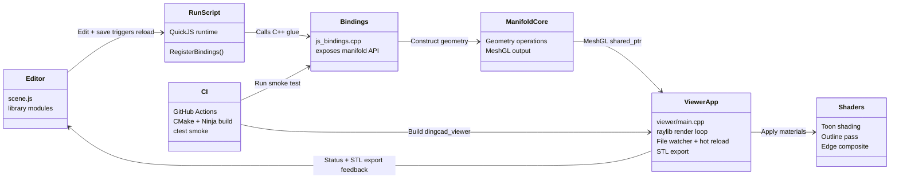

# Dingcad Architecture

This diagram captures the primary runtime flow and supporting build layers.

Key interactions:

When you edit your JavaScript scene files and hit save, the viewer picks them up and runs them inside its QuickJS runtime. A small bindings layer does the translation work, turning those JS calls into manifold operations and handing back `manifold::Manifold` handles. Manifold produces a mesh that the raylib viewer renders, while the app handles camera controls, toon shading, outlines, and STL export. In continuous integration we install the dependencies, build the executable with CMake and Ninja, and run a smoke test that exercises the QuickJS bindings.
